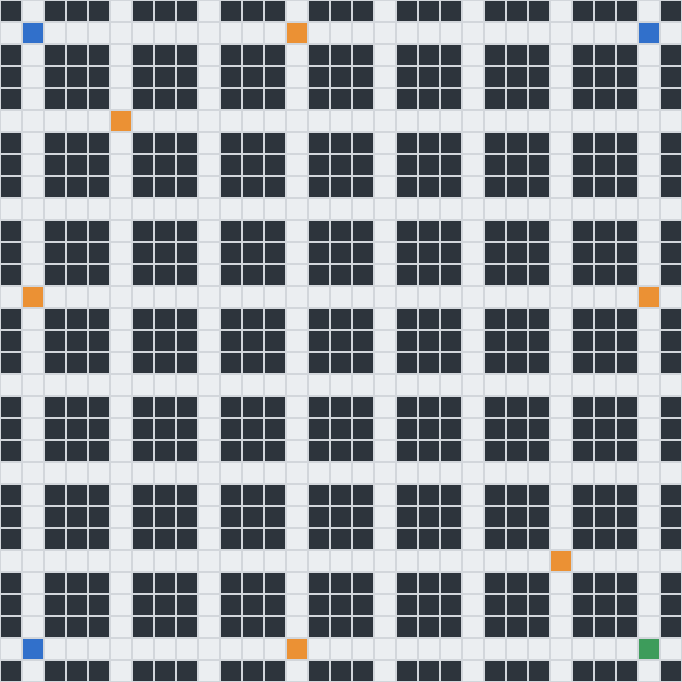
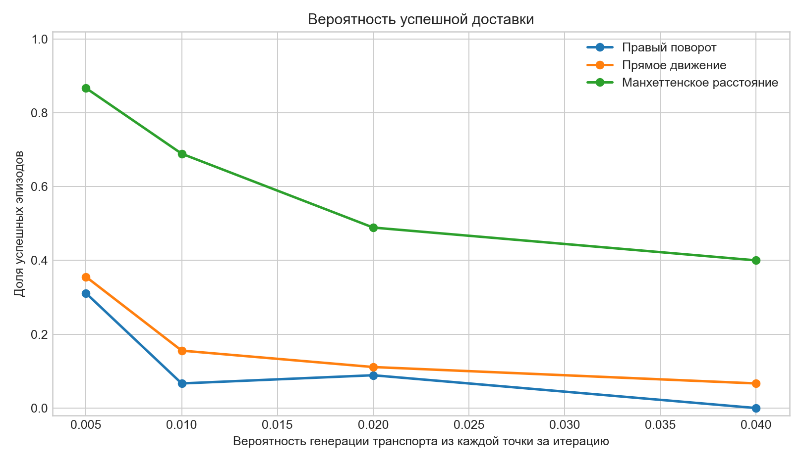
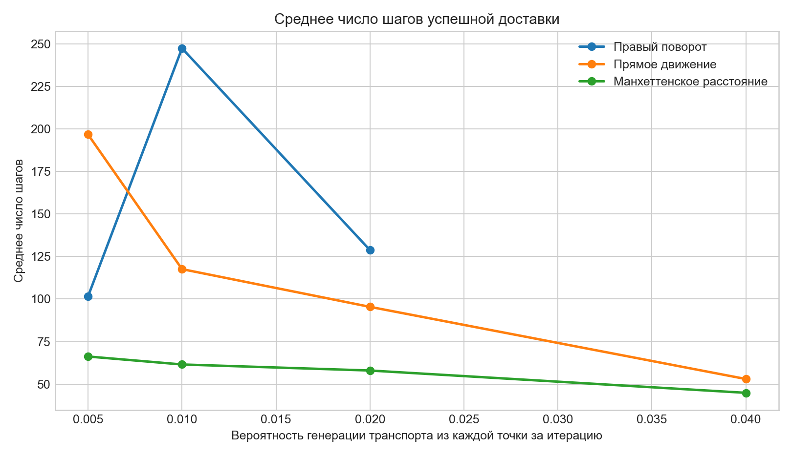

# Лабораторная работа 4

## Реализация многоагентной среды с помощью многопроцессных вычислений

Цель работы: получить навыки создания многоагентной среды с неопределенностью с применением многопроцессных вычислений.

В работе смоделирована городская дорожная сеть, в которой агент-доставщик должен добраться из одной из стартовых точек `2` в точку доставки `4`. Другие транспортные средства появляются в точках `3` с заданной вероятностью и двигаются независимо от агента. Движение доставщика вычисляется отдельным процессом, движение транспортного потока — вторым процессом; основной процесс синхронизирует итерации и обрабатывает аварии.

## Карта

Файл карты: [`citymap.txt`](citymap.txt)

- `0` — дорога;
- `1` — препятствие/здание;
- `2` — стартовые точки доставщика;
- `3` — точки генерации транспорта;
- `4` — точка доставки.

Размер карты: 31 x 31. Стартовые позиции агента: (1, 1), (1, 29), (29, 1). Точки генерации транспорта: (1, 13), (5, 5), (13, 1), (13, 29), (25, 25), (29, 13). Цель доставки: (29, 29).

## Правила модели

На каждой итерации агент и транспортные средства выбирают одно действие: вверх, вниз, влево, вправо или остановка.

Для транспорта реализованы правила из задания:

- при появлении из клетки `3` бот получает случайное время жизни от 15 до 150 итераций;
- в коридоре бот продолжает движение по единственному доступному направлению;
- в тупике бот разворачивается;
- на перекрестке с вероятностью 10% бот останавливается, а на следующем ходу разворачивается;
- оставшиеся 90% распределяются равномерно между доступными направлениями, кроме обратного.

Если два бота оказываются в одной клетке или обмениваются клетками за одну итерацию, они удаляются как попавшие в аварию. Если с ботом сталкивается агент, эпизод считается неуспешным.

## Стратегии доставщика

Проверялись три стратегии прохождения развилок:

- **Правый поворот**: 5% остановка+разворот, 40% направо, 30% прямо, 25% налево.
- **Прямое движение**: 5% остановка+разворот, 20% направо, 55% прямо, 20% налево.
- **Манхеттенское расстояние**: 5% остановка+разворот, затем повышенный вес направлений, уменьшающих расстояние до доставки.

В обычном коридоре агент продолжает движение, в тупике разворачивается. Если агент успешно достигает клетки `4`, фиксируется число шагов доставки.

## Параллельная организация

Скрипт [`lab4_multiprocessing_simulation.py`](lab4_multiprocessing_simulation.py) использует модуль `multiprocessing`.

- Процесс агента получает текущее состояние доставщика и выбранную стратегию, после чего возвращает новое положение.
- Процесс транспорта получает список активных ботов и вероятность генерации, после чего возвращает обновленный список транспорта.
- Главный процесс выполняет барьер синхронизации итераций, проверяет столкновения и собирает статистику.

Такой вариант оставляет модель детерминированной при заданном seed, но разделяет вычисление движений между процессами.

## Эксперимент

Параметры запуска:

- seed: `2026`;
- эпизодов на одну комбинацию стартовой точки, стратегии и вероятности генерации: `15`;
- максимальная длина эпизода: `350` шагов;
- вероятности генерации транспорта: `0.005, 0.010, 0.020, 0.040`.

Так как на карте несколько стартовых позиций, в итоговых таблицах результаты агрегированы по всем стартам.

## Результаты

| Стратегия | p генерации | Эпизодов | Вероятность успеха | Средние шаги успешных | Аварии агента | Тайм-ауты |
|---|---:|---:|---:|---:|---:|---:|
| Правый поворот | 0.005 | 45 | 0.31 | 101.6 | 24 | 7 |
| Правый поворот | 0.010 | 45 | 0.07 | 247.3 | 39 | 3 |
| Правый поворот | 0.020 | 45 | 0.09 | 128.8 | 39 | 2 |
| Правый поворот | 0.040 | 45 | 0.00 | нет успехов | 45 | 0 |
| Прямое движение | 0.005 | 45 | 0.36 | 196.7 | 26 | 3 |
| Прямое движение | 0.010 | 45 | 0.16 | 117.6 | 36 | 2 |
| Прямое движение | 0.020 | 45 | 0.11 | 95.4 | 39 | 1 |
| Прямое движение | 0.040 | 45 | 0.07 | 53.0 | 42 | 0 |
| Манхеттенское расстояние | 0.005 | 45 | 0.87 | 66.2 | 6 | 0 |
| Манхеттенское расстояние | 0.010 | 45 | 0.69 | 61.5 | 14 | 0 |
| Манхеттенское расстояние | 0.020 | 45 | 0.49 | 58.0 | 23 | 0 |
| Манхеттенское расстояние | 0.040 | 45 | 0.40 | 44.9 | 27 | 0 |

Анимация успешного эпизода: [`outputs/agent_path_success.gif`](outputs/agent_path_success.gif)

## Выводы

По суммарной оценке лучшей оказалась стратегия **Манхеттенское расстояние**: средняя вероятность успеха по всем скоростям генерации составила 0.61, а среднее число шагов успешных доставок — 57.7.

Увеличение вероятности генерации транспорта ожидаемо снижает вероятность успешной доставки: на дорогах появляется больше ботов, поэтому растет риск столкновения. Среднее число шагов успешных доставок меняется не монотонно: при высокой плотности транспорта часть долгих и опасных эпизодов заканчивается аварией или тайм-аутом и не попадает в среднее по успешным доставкам.

Стратегии, учитывающие направление к цели, в среднем эффективнее случайных поворотных правил, потому что агент реже уходит в длинные петли дорожной сетки. При этом даже целевая стратегия не гарантирует успех: неопределенность создается случайной генерацией транспорта, случайным выбором движения на перекрестках и аварийными ситуациями.

## Состав файлов

- [`citymap.txt`](citymap.txt) — карта дорожной сети;
- [`lab4_multiprocessing_simulation.py`](lab4_multiprocessing_simulation.py) — программный код с комментариями;
- [`outputs/episode_results.csv`](outputs/episode_results.csv) — результаты всех эпизодов;
- [`outputs/summary_results.csv`](outputs/summary_results.csv) — агрегированная статистика;
- [`outputs/map.png`](outputs/map.png) — визуализация карты;
- [`outputs/success_probability_by_strategy.png`](outputs/success_probability_by_strategy.png) — график вероятности успеха;
- [`outputs/avg_steps_by_strategy.png`](outputs/avg_steps_by_strategy.png) — график среднего числа шагов;
- [`outputs/agent_path_success.gif`](outputs/agent_path_success.gif) — анимированная визуализация успешной доставки.
